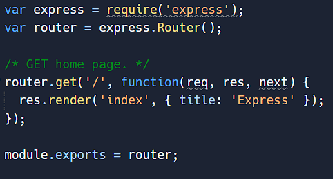

# Callback

Callback, merupakan mekanisme untuk memanggil kembali kode yang ada di program dari proses Async


Callback biasanya dibuat dalam bentuk function as parameter, dan parameter function tersebut akan dieksekusi saat proses Async selesai

Dengan menggunakan Callback, program bisa menerima informasi yang dibutuhkan dari proses yang berjalan secara Async


### Contoh sequence function

Fungsi JavaScript dieksekusi dalam urutan yang disebutkan. Tidak dalam urutan ketika didefinisikan

<figure><figcaption></figcaption></figure>

### Contoh sequence function

<figure><figcaption></figcaption></figure>

### Contoh memanggil fungsi di dalam fungsi

<figure><figcaption></figcaption></figure>

### Contoh fungsi Callback

<figure><figcaption></figcaption></figure>

