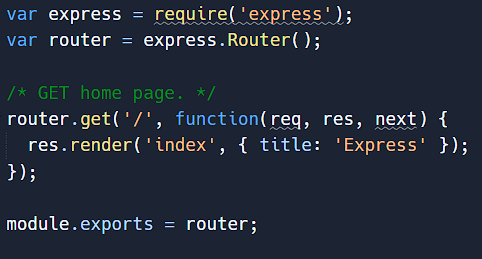

# Membuat kerangka kerja  dengan express generator

#### Membuat kerangka kerja / struktur folder dengan express generator

install express generator secara global


npm install express-generator -g


install express js dengan tamplate engine EJS


express --ejs


apa itu EJS

EJS (Embedded JavaScript Templating) adalah salah satu template engine paling populer untuk JavaScript. Seperti namanya, ini memungkinkan kita menyematkan kode JavaScript dalam bahasa template yang kemudian digunakan untuk menghasilkan HTML.

<figure><figcaption></figcaption></figure>

kemudian jalankan&#x20;


```
npm install
```


lalu jalankan npm start untuk menjalankan servernya


npm start&#x20;


hasil server

<figure><figcaption></figcaption></figure>
