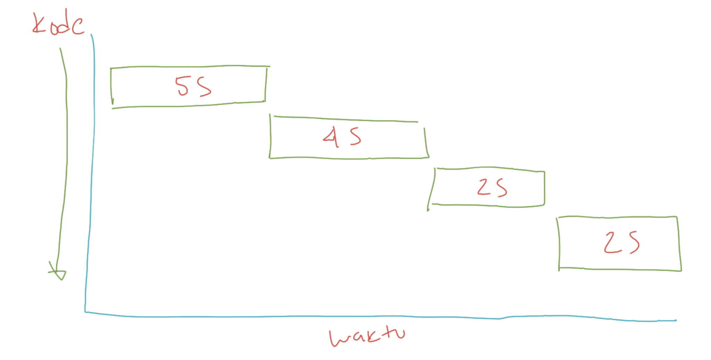

# Synchronous vs Asynchronous

> Saat membuat aplikasi yang concurrent atau parallel, kadang kita sering menemui istilah synchronous dan asynchronous Tidak perlu bingung dengan istilah tersebut, secara sederhana Synchronous adalah ketika kode program kita berjalan secara sequential, dan semua tahapan ditunggu sampai prosesnya selesai baru akan dieksekusi ke tahapan selanjutnya Sedangkan, Asynchronous artinya ketika kode program kita berjalan dan kita tidak perlu menunggu eksekusi kode tersebut selesai, kita bisa lanjutkan ke tahapan kode program selanjutnya

### Diagram Synchronous

### Diagram Asynchronous

### Apa itu Synchronous?

Program dalam JavaScript secara default akan dieksekusi baris per baris Secara default, proses di JavaScript akan dieksekusi secara Synchronous, artinya baris selanjutnya akan dieksekusi setelah baris sebelumnya selesai dikerjakan Proses Synchronous juga biasa disebut Blocking, karena harus menunggu tiap proses selesai, baru proses selanjutnya bisa dilakukan

**Contoh Synchronous**

<figure><figcaption></figcaption></figure>

### **Apa itu Asynchronous?**

Walaupun secara default proses di JavaScript dieksekusi secara Synchronous, namun kita bisa membuatnya menjadi Asynchronous. Berbeda dengan proses Synchronous, pada proses Asynchronous, JavaScript tidak akan <mark style="color:orange;">menunggu proses tersebut selesai</mark>, melainkan JavaScript akan melanjutkan baris selanjutnya, <mark style="color:orange;">tanpa harus menunggu</mark> proses Asynchronous selesai. Proses Asynchronous juga biasa disebut <mark style="color:orange;">Non-Blocking</mark>.

**Contoh Asynchronous**

<figure><figcaption></figcaption></figure>

