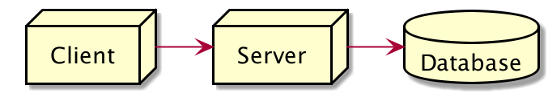

# Web Application

### Web Application

Web Application adalah aplikasi yang berjalan di Server dan ditampilkan di Browser Client Saat kita membuat Web Application, biasanya akan dibagi menjadi 3 bagian, Client, Server dan Database

### Client

Client merupakan user interface atau bagian frontend dari web application, yang digunakan oleh pengguna web application. Client digunakan untuk berinteraksi dengan Server, baik itu mengirim data atau menerima data Frontend biasanya dibuat menggunakan HTML, CSS dan JavaScript

### Server

* Server bertanggung jawab untuk menerima request dari Client, mengerjakan request yang dikirim dan membalas request berupa response ke Client
* Server bertugas sebagai backend untuk web application, dimana semua logic aplikasi akan dilakukan di Server&#x20;
* Biasanya Server dibuat menggunakan PHP, Pythton, Java, .NET dan banyak bahasa pemrograman lainnya&#x20;
* Dengan adanya NodeJS, sekarang kita bisa membuat Server menggunakan JavaScript

### Database

* Database adalah tempat untuk menyimpan data web application
* Data disimpan dan diambil oleh Server.
* Client tidak bisa langsung mengambil atau menyimpan data ke Database secara langsung, oleh karena itu perlu penengah untuk melakukannya, yaitu Server
* Database biasanya menggunakan aplikasi sistem basis data seperti misalnya MySQL, PostgreSQL, MongoDB dan lain-lain

### Frontend dan backend

_Front End_ dan _Back End_ adalah dua hal yang berkaitan dengan bagaimana sebuah _website_ maupun aplikasi dapat bekerja dan diakses oleh pengguna.

Berkaitan dengan proses _web development_, _front end_ adalah apa yang pengguna lihat pada tampilan sebuah _website._ Sedangkan _back end_ adalah sistem di balik layar yang mengolah _database_ dan juga server.

<figure><figcaption></figcaption></figure>

### Web Dinamis dan API

* API adalah singkatan dari _Application Programming Interface_, yaitu sebuah software yang memungkinkan para developer untuk mengintegrasikan dan mengizinkan dua aplikasi yang berbeda secara bersamaan untuk saling terhubung satu sama lain.
*

    <figure><figcaption>
API
</figcaption></figure>
* Web dinamis merupakan sebuah _website_ yang memungkinkan penggunanya untuk berinteraksi secara langsung, dalam artian pengguna dapat menambah, memodifikasi, ataupun menghapus konten di dalam sebuah web tanpa harus membuka struktur kode dari web tersebut.&#x20;
*

    <figure><figcaption></figcaption></figure>

### Diagram perbandingan web api dan web dinamis

<figure><figcaption></figcaption></figure>
