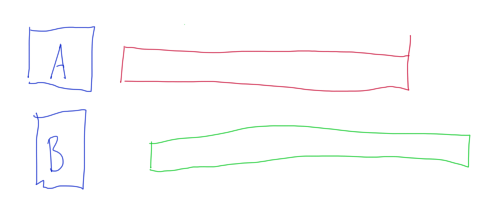

# Concurrency dan Parallel

### Sejarah


Dahulu, komputer hanya menjalankan sebuah program pada satu waktu Karena hanya bisa menjalankan satu program pada satu waktu, hal ini tidak efisien dan memakan waktu lama karena hanya bisa mengerjakan satu tugas pada satu waktu Semakin kesini, sistem operasi untuk komputer semakin berkembang, sekarang sistem operasi bisa menjalankan program secara bersamaan dalam proses yang berbeda-beda, terisolasi dan saling independen antar program


### Thread

Program biasanya berjalan dalam sebuah proses, dan proses akan memiliki resource yang independen dengan proses lain Sekarang, sistem operasi tidak hanya bisa menjalankan multiple proses, namun dalam proses kita bisa menjalankan banyak pekerjaan sekaligus, atau bisa dibilang proses ringan atau lebih dikenal dengan nama Thread Thread membuat proses aplikasi bisa berjalan tidak harus selalu sequential, kita bisa membuat proses aplikasi berjalan menjadi asynchronous atau parallel

### Concurrency vs Parallel


Kadang banyak yang bingung dengan concurrency dan parallel, sebenarnya kita tidak perlu terlalu memusingkan hal ini Karena saat ini, kita pasti akan menggunakan keduanya ketika membuat aplikasi Concurrency artinya mengerjakan beberapa pekerjaan satu persatu Parallel artiya mengerjakan beberapa pekerjaan sekaligus pada satu waktu


### Diagram Parallel

### Contoh Concurrency dan Parallel


Browser adalah aplikasi yang concurrent dan parallel Browser akan melakukan proses concurrent ketika membuka web, browser akan melakukan http request, lalu mendownload semua file web (html, css, js) lalu merender dalam bentuk tampilan web Browser akan melakukan proses parallel, ketika kita membuka beberapa tab web, dan juga sambil download beberapa file, dan menonton video dari web streaming

