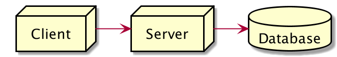

# Web Application

### Web Application

Web Application adalah aplikasi yang berjalan di Server dan ditampilkan di Browser Client Saat kita membuat Web Application, biasanya akan dibagi menjadi 3 bagian, Client, Server dan Database

### Client

Client merupakan user interface atau bagian frontend dari web application, yang digunakan oleh pengguna web application. Client digunakan untuk berinteraksi dengan Server, baik itu mengirim data atau menerima data Frontend biasanya dibuat menggunakan HTML, CSS dan JavaScript

### Server

* Server bertanggung jawab untuk menerima request dari Client, mengerjakan request yang dikirim dan membalas request berupa response ke Client
* Server bertugas sebagai backend untuk web application, dimana semua logic aplikasi akan dilakukan di Server&#x20;
* Biasanya Server dibuat menggunakan PHP, Pythton, Java, .NET dan banyak bahasa pemrograman lainnya&#x20;
* Dengan adanya NodeJS, sekarang kita bisa membuat Server menggunakan JavaScript
