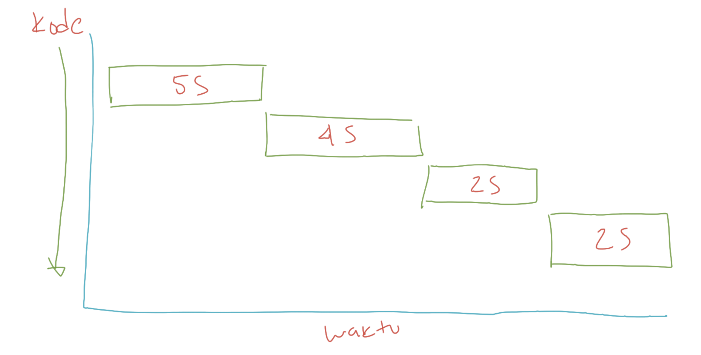
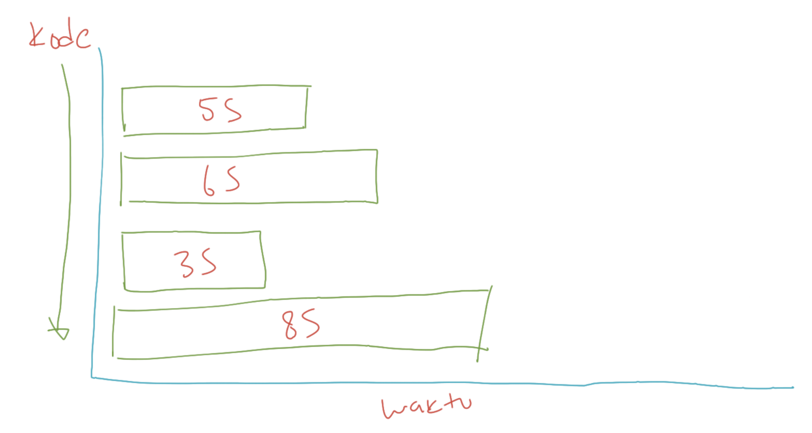

# Synchronous vs Asynchronous

> Saat membuat aplikasi yang concurrent atau parallel, kadang kita sering menemui istilah synchronous dan asynchronous Tidak perlu bingung dengan istilah tersebut, secara sederhana Synchronous adalah ketika kode program kita berjalan secara sequential, dan semua tahapan ditunggu sampai prosesnya selesai baru akan dieksekusi ke tahapan selanjutnya Sedangkan, Asynchronous artinya ketika kode program kita berjalan dan kita tidak perlu menunggu eksekusi kode tersebut selesai, kita bisa lanjutkan ke tahapan kode program selanjutnya

### Diagram Synchronous

### Diagram Asynchronous

